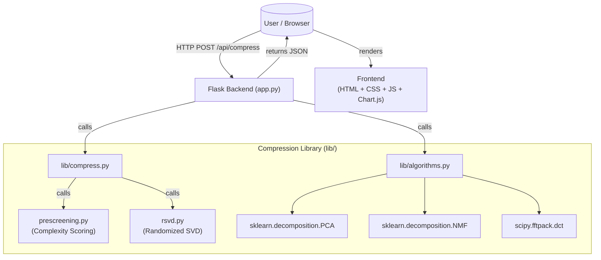
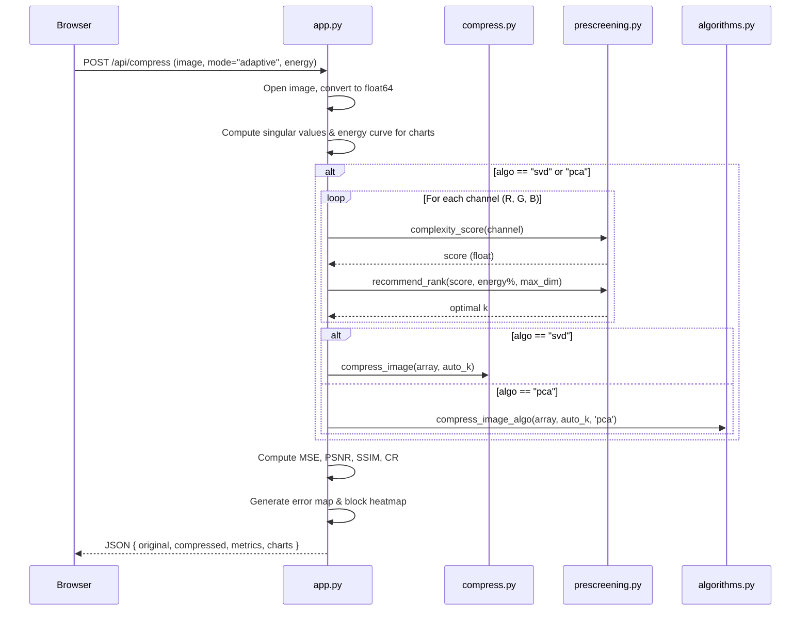

# Data Science Image Compressor (SVD, PCA, NMF, DCT)

An interactive, mathematical image compression laboratory that leverages advanced linear algebra and matrix factorization to reduce file sizes while maintaining image quality.

Built with a high-performance Python (Flask + NumPy + Scikit-Learn) backend and a beautiful, responsive frontend featuring a modern glassmorphism UI with real-time analytics.

---

## ✨ Features

- **Four Powerful Algorithms:**
  - `SVD (Randomized)`: Blazing fast Singular Value Decomposition using random projections.
  - `PCA (Principal Components)`: Covariance-based dimensionality reduction.
  - `NMF (Non-negative Matrix Factorization)`: Additive, parts-based image reconstruction.
  - `DCT (Discrete Cosine Transform)`: Frequency domain compression (the math behind JPEG).
- **Dual Compression Modes:**
  - `Basic Mode`: Manually set the number of components ($k$) to see immediate compression vs. quality tradeoffs (available for all algorithms).
  - `Adaptive Mode`: Set a target energy retention % (e.g. 95%) — the system automatically calculates and selects the optimal $k$ **per color channel** using complexity pre-screening (available for **SVD** and **PCA**).
- **Algorithm Speed Benchmark:**
  - Instantly race all 4 algorithms against each other on the same image to visualize execution times in a comparative bar chart.
- **Real-Time Analytics & Metrics:**
  - Computes MSE, PSNR (dB), SSIM, and Compression Ratio instantly after each compression.
- **Interactive Visualizations:**
  - Before/After drag slider for pixel-perfect comparison.
  - Rich Chart.js charts: Singular Value Decay, Cumulative Energy, PSNR vs $k$, SSIM vs $k$, Storage Savings vs Quality, and Algorithm Benchmark.
  - Error map and block complexity heatmap.
- **PDF Report:** Download a formatted PDF of compression results.
- **Premium UI/UX:** Glassmorphism, animated aurora background, persistent dark/light mode toggle.

---

## 🏗️ System Architecture



---

## 🔄 Adaptive Request Flow



---

## 🛠️ Technology Stack

| Layer | Technology |
|---|---|
| **Backend** | Python 3.10+, Flask 3.x, Flask-CORS |
| **Data Science** | NumPy, Scikit-Learn, SciPy |
| **Image I/O** | Pillow ≥ 10.0 |
| **Frontend** | HTML5, CSS3, Vanilla JS, Chart.js 4.4.1 |

---

## 🚀 Quickstart

1. **Install Dependencies:**
```bash
pip install -r requirements.txt
```

2. **Run the Server:**
```bash
python app.py
```

3. **Open in Browser:**
Navigate to `http://localhost:5000`

---
*Created as an educational exploration into linear algebra, matrix factorization, and advanced data compression techniques.*
