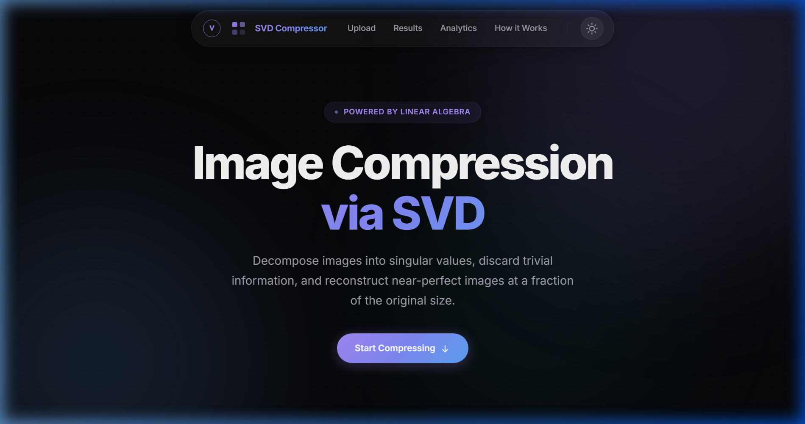
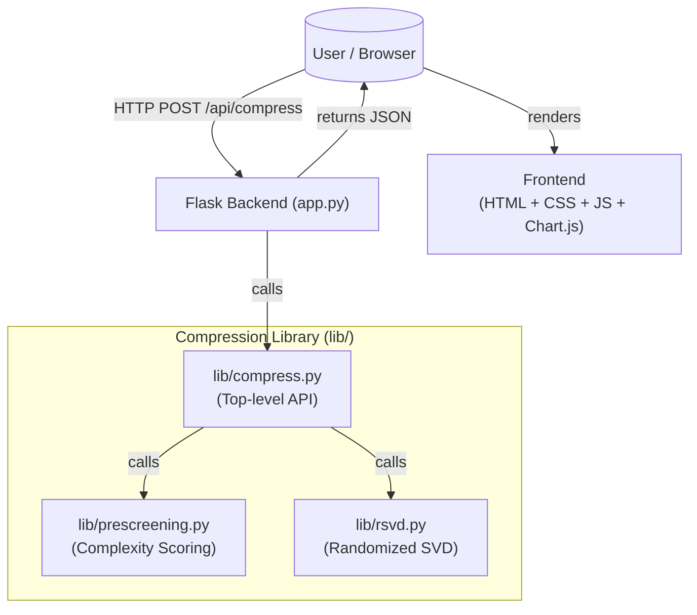
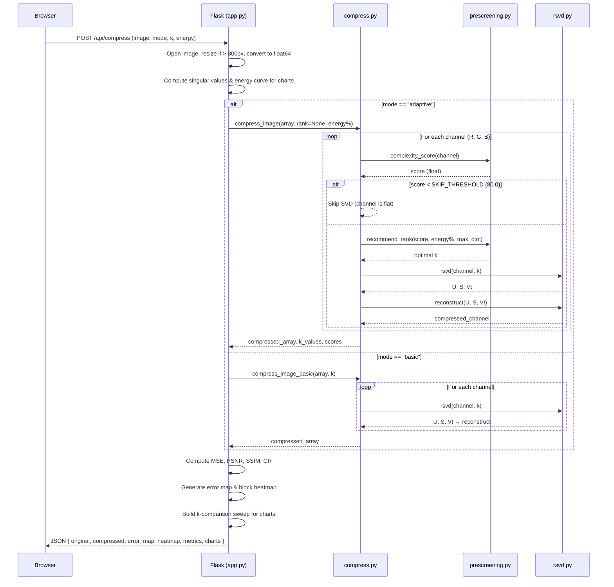

# SVD Image Compressor

An interactive, mathematical image compression tool that leverages Singular Value Decomposition (SVD) to reduce file sizes while maintaining image quality.

Built with a high-performance Python (Flask + NumPy) backend and a beautiful, responsive frontend featuring a modern glassmorphism UI with real-time analytics.



---

## ✨ Features

- **Dual Compression Modes:**
  - `Basic SVD`: Manually set the number of singular values ($k$) to see immediate compression vs. quality tradeoffs.
  - `Adaptive SVD`: Set a target energy retention % (e.g. 95%) — the algorithm auto-selects the optimal $k$ **per color channel** using complexity pre-screening.
- **Real-Time Analytics & Metrics:**
  - Computes MSE, PSNR (dB), SSIM, and Compression Ratio instantly after each compression.
- **Interactive Visualizations:**
  - Before/After drag slider for pixel-perfect comparison.
  - Rich Chart.js charts: Singular Value Decay, Cumulative Energy, PSNR vs $k$, SSIM vs $k$.
  - Error map and block complexity heatmap.
- **PDF Report:** Download a formatted PDF of compression results via ReportLab.
- **Premium UI/UX:** Glassmorphism, animated aurora background, persistent dark/light mode toggle.
- **Fast In-Memory Processing** — no disk writes, powered entirely by NumPy.

---

## 🏗️ System Architecture



---

## 🔄 Request Flow (Sequence Diagram)



---

## 🛠️ Technology Stack

| Layer | Technology |
|---|---|
| **Backend** | Python 3.10+, Flask 3.x, Flask-CORS |
| **Numerical** | NumPy ≥ 1.24 |
| **Image I/O** | Pillow ≥ 10.0 |
| **PDF Reports** | ReportLab ≥ 4.0 |
| **Frontend** | HTML5, Vanilla CSS3, Vanilla JS (ES6+) |
| **Charts** | Chart.js 4.x (CDN) |
| **Fonts** | Inter + JetBrains Mono (Google Fonts) |
| **Deployment** | Vercel (serverless, `vercel.json` included) |

---

## 🚀 Getting Started

### Prerequisites

Python 3.8+ installed.

### Installation

```bash
# 1. Clone the repo
git clone https://github.com/raghavkp2006-ux/svdcompressor.git
cd svdcompressor

# 2. Create a virtual environment (recommended)
python -m venv .venv
.venv\Scripts\activate   # Windows
# source .venv/bin/activate  # macOS / Linux

# 3. Install dependencies
pip install -r requirements.txt
```

### Running Locally

```bash
python app.py
```

Navigate to `http://127.0.0.1:5000` in your browser.

---

## 🧠 How It Works

### 1. Decompose
Each color channel (R, G, B) is treated as matrix **A** and decomposed:

$$A = U \Sigma V^T$$

### 2. Truncate
Only the top $k$ singular values are kept — the rest are discarded:

$$A_k = U_k \Sigma_k V_k^T$$

By the **Eckart–Young theorem**, this is the optimal rank-$k$ approximation.

### 3. Reconstruct
The compressed image is rebuilt from far fewer numbers:

$$\text{Storage: } k(m + n + 1) \text{ vs original } m \times n$$

### 4. Evaluate
Quality is measured via PSNR, SSIM, MSE, and Compression Ratio — all displayed in real time.

---

## 📁 Project Structure

```
svdcompressor/
├── app.py                  # Flask backend — routes, metrics, PDF generation
├── requirements.txt
├── vercel.json             # Vercel deployment config
├── docs/
│   └── screenshot.png      # App screenshot
├── lib/
│   ├── rsvd.py             # Randomized SVD core (Halko et al. 2011)
│   ├── prescreening.py     # Block-variance complexity scoring
│   └── compress.py         # Top-level compression API
├── static/
│   ├── style.css           # Design system (1678 lines, glassmorphism)
│   └── script.js           # Frontend logic & Chart.js rendering
└── templates/
    └── index.html          # Single-page application
```

---

## 📊 Expected Results

| Rank (k) | Compression Ratio | PSNR | SSIM | Quality |
|---|---|---|---|---|
| 5 | ~50× | ~20 dB | ~0.60 | Heavy artifacts |
| 20 | ~15× | ~28 dB | ~0.80 | Recognizable |
| 50 | ~6× | ~35 dB | ~0.92 | Good |
| 100 | ~3× | ~40 dB | ~0.97 | Near-lossless |
| 200 | ~1.5× | ~45 dB | ~0.99 | Indistinguishable |

---

## 📄 References

1. Halko, N., Martinsson, P. G., & Tropp, J. A. (2011). *Finding Structure with Randomness*. SIAM Review.
2. Eckart, C., & Young, G. (1936). *The approximation of one matrix by another of lower rank*. Psychometrika.
3. Wang, Z. et al. (2004). *Image Quality Assessment: From Error Visibility to Structural Similarity*. IEEE TIP.

---

## 📝 License

Open-sourced under the MIT License.
